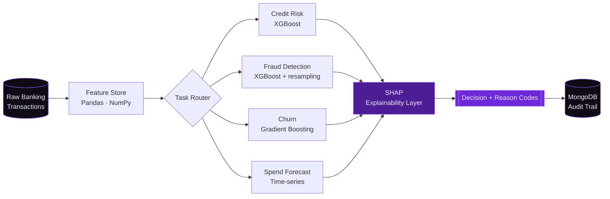
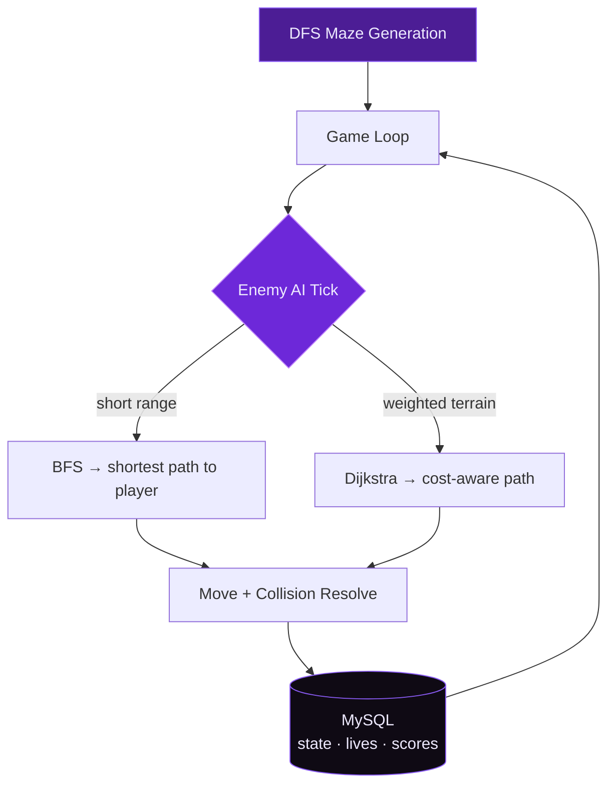
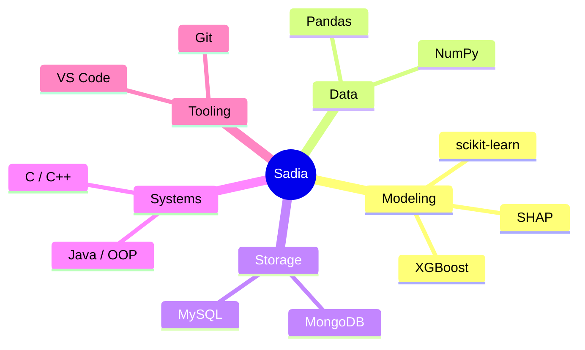

  

 

> *"An approximate answer to the right question is worth more than a precise answer to the wrong one."* — John Tukey

 

## 🕯️ about me

BSCS '28 at Sukkur IBA University, working at the intersection of machine learning and interpretability. I build models that don't just make predictions — they justify them, which matters most in high-stakes, regulated settings like finance.

<table>
<tr>
<td width="25%" align="center">🎓 <b>3.65 / 4.0</b> CGPA</td>
<td width="25%" align="center">📍 <b>Sindh, PK</b> based in</td>
<td width="25%" align="center">🔮 <b>XAI</b> obsession</td>
<td width="25%" align="center">💜 <b>open</b> to remote work</td>
</tr>
</table>

<b>⚡ three things about how I work</b> &nbsp;(click)

 

| | |
|---|---|
| **Metrics follow the business, not the leaderboard** | A 0.94 AUC that costs the bank money is a failed model. I define the cost matrix before I define the architecture. |
| **Every prediction gets a receipt** | SHAP values, feature attributions, counterfactuals — if a loan officer can't explain a rejection to a customer, the model isn't deployable. |
| **Ship the boring parts too** | Persistence layers, schema design, retraining triggers. The notebook is 20% of the work. |

---

<picture>
  <source media="(prefers-color-scheme: dark)" srcset="https://raw.githubusercontent.com/platane/snk/output/github-contribution-grid-snake-dark.svg"/>
  <source media="(prefers-color-scheme: light)" srcset="https://raw.githubusercontent.com/platane/snk/output/github-contribution-grid-snake.svg"/>
  
</picture>

---

## 🩸 featured work

every card below expands — click a title for architecture, decisions, and results.

 

<b>🏦 FinGuard AI</b> &nbsp;—&nbsp; ML Decision Engine for Banking

 

A unified pipeline for **credit risk, fraud detection, churn, and spend forecasting** — one system, business-driven metrics, SHAP-based explainability throughout.

**Design decisions**
- Optimized for **expected cost**, not accuracy — false negatives on fraud are ~40× the cost of false positives, so the threshold is tuned on a cost curve rather than F1.
- **SHAP at inference time**, not just in analysis — every decision writes reason codes to the audit trail, so the system is defensible under regulatory review.
- Shared feature store across all four tasks — one source of truth, no training/serving skew.

`Python` `XGBoost` `SHAP` `scikit-learn` `Pandas` `MongoDB`

> 🏅 Showcased at Sukkur IBA as an **Applied ML Benchmark**

<b>🧩 Maze Adventure</b> &nbsp;—&nbsp; Algorithmic Game Engine

 

Live **BFS/DFS enemy navigation**, a DFS-generated maze, and full MySQL persistence for lives, state, and leaderboards.

**Why it's interesting:** the enemy pathfinder re-plans every tick against a mutating grid, so the interesting problem wasn't implementing BFS — it was keeping it cheap enough to run at frame rate while the maze state changed underneath it.

`Java` `Swing` `BFS/DFS` `Dijkstra` `MySQL`

> 🏅 Recognized at the **AI & CS Expo, 2024**

<b>🚀 Space Shooter</b> &nbsp;—&nbsp; OOP Architecture Study

 

A deliberately non-trivial codebase built to demonstrate disciplined object-oriented design — an `Entity` hierarchy driving inheritance and polymorphism, encapsulated state, and a MySQL-backed scoring layer.

The goal was architectural, not visual: adding a new enemy type or weapon should require **zero changes to the game loop**. It does.

`Java` `Swing` `MySQL` `OOP`

> 🏅 **Runner-Up, SIBA Fest 2025**

<b>🛠️ In Progress</b> &nbsp;—&nbsp; Raasta &amp; Resume Analyzer AI

 

| Project | What it does | Status |
|---|---|---|
| **Raasta** | Conversational AI assistant — retrieval-grounded, built for low-bandwidth contexts | 🟣 In development |
| **Resume Analyzer AI** | ML-powered resume parsing + structured evaluation against role criteria | 🟣 In development |

`Python` `NLP` `LLM` `spaCy`

---

## ⚰️ toolbox

hover any icon for its name

 

<b>🗺️ how the stack fits together</b>

 

| Domain | Stack | Depth |
|---|---|---|
| 🧠 Modeling | scikit-learn · XGBoost · SHAP |  |
| 📊 Data | Pandas · NumPy |  |
| 🗃️ Storage | MySQL · MongoDB |  |
| ☕ Systems | Java · C++ · C |  |

---

## 👻 GitHub pulse

  

  

---

## 🦇 milestones

<b>2026</b>

- Selected Participant, **McKinsey Forward Program** — McKinsey & Company
- Campus Ambassador, **LoopLab** — selected representative
- **FinGuard AI** showcased as an Applied ML Benchmark — Sukkur IBA

<b>2025</b>

- Selected, Global Pool — **Harvard Aspire Leaders Program** (Harvard University)
- **International ML Summer School** — cohort of 10,000+
- Runner-Up, Project Competition — **SIBA Fest**
- Merit Award, **PM Youth Laptop Scheme** — top BSCS nationally (Govt. of Pakistan)

<b>2024</b>

- Certificate of Recognition, **AI & CS Expo** — Sukkur IBA

<b>📜 certifications</b>

 

| Certification | Issuer | Year |
|---|---|:---:|
| McKinsey Forward Program | McKinsey & Company | 2026 |
| Google AI Essentials | Coursera / Google | 2026 |
| Google Prompting Essentials | Coursera / Google | 2026 |
| Intro to MongoDB | Credly | 2026 |
| International ML Summer School | Global Cohort | 2025 |
| Harvard Aspire Leaders Program | Harvard University | 2025 |

---

## 🕷️ leadership & involvement

<table>
<tr>
<td width="33%" valign="top">

**McKinsey Forward**
Selected Participant · 2026

Global career-readiness program covering structured problem-solving, communication, and workplace effectiveness.

</td>
<td width="34%" valign="top">

**LoopLab**
Campus Ambassador · 2026–Present

Driving awareness and program participation at IBA Sukkur.

</td>
<td width="33%" valign="top">

**CS Society**
Executive Member · 2025–2026

Merit-selected; co-organized SIBAthon'26 end-to-end.

</td>
</tr>
</table>

---

---

## 💜 I will love to connect !

open to remote roles, research collaborations, and anything involving interpretable ML.

  

